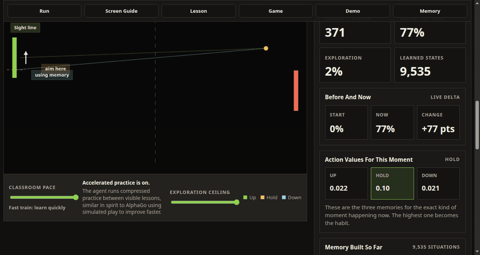

# PongLearn

PongLearn is a browser simulation of a reinforcement-learning agent learning Pong through experience.



The animation above is captured from the live Pong view: the learner paddle moves, the ball state changes, and the side panel shows the same moment's hit rate, exploration level, learned states, and action values.

The app takes the transferable principle from DeepMind-style game learning: the system creates its own experience, receives reward from outcomes, updates a policy/value estimate, and gradually shifts from exploration to exploitation. For this repository, the first implementation uses tabular Q-learning instead of a neural network so the learning process is visible and inspectable in real time.

The interface begins with a short educational walkthrough that explains what the simulation is, how it is inspired by DeepMind's AlphaGo work, and what to watch once the lab starts. After that, a viewer can run a 30, 60, or 120 second training session and watch the same loop repeat: observe the game state, choose an action, receive reward, and update one stored action value. The lesson card, mastery path, canvas annotations, memory tiles, event log, Q-value cards, and policy map are designed to make the learning process legible instead of hiding it behind a final score.

The AlphaGo grounding comes from Silver et al., "Mastering the game of Go with deep neural networks and tree search" in Nature: policy networks select moves, value networks evaluate positions, reinforcement learning improves play through self-play, and search combines those estimates. PongLearn uses those ideas as an analogy only; it is intentionally smaller and transparent.

## Run

```bash
npm run serve
```

Open `http://localhost:4173`.

## Test

```bash
npm test
```

## What To Watch

PongLearn is built as an educational experience, not just a moving Pong clone. The run starts with a guided introduction, then switches into a fixed-time experiment so viewers can compare learning progress from the same starting point.

- The `Run` panel is the experiment clock. When it reaches the end, learning stops.
- The `Lesson` panel turns one reward update into plain language: what happened, whether it was useful, and how the remembered value changed.
- The `Game` panel shows the state the agent currently sees: ball, paddle, target estimate, chosen action, and whether it is exploring or using memory.
- The `Memory` panel shows the Q-values and policy map that stand in for the agent's learned preferences.
- The `Demo` panel appears after training and freezes the policy. Exploration and value updates turn off, so the viewer sees how the trained paddle performs without more practice.

## How It Works

- The Pong game is the environment.
- The left paddle is the learning agent.
- The right paddle is a mentor opponent with imperfect tracking.
- The agent observes a discretized state: ball position, ball velocity, paddle position, and relative ball/paddle distance.
- Actions are `Up`, `Hold`, and `Down`.
- Rewards encourage hits, penalize misses, and provide small shaping while the ball approaches.
- The policy map visualizes which action currently has the highest value for nearby incoming-ball states.
- The timed run fixes the wall-clock training window so progress can be compared from the same starting point.
- The game canvas labels the sight line, target estimate, and current action mode so the motion has an educational purpose.
- Guided pace is the default: the game advances slowly and briefly holds after meaningful lessons so viewers can read what changed.
- The `Next Lesson` control skips ahead to the next important feedback moment and pauses there for inspection.
- Accelerated practice runs compressed training between displayed lessons so the hit rate improves faster without making the lesson text unreadable.
- After training, the app switches into a frozen-policy demo: exploration and Q-value updates stop, and the return-attempt hit rate shows how the learned policy performs.

## DeepMind Inspiration

PongLearn is grounded in the learning loop made famous by AlphaGo: estimate good actions, estimate future outcomes, improve those estimates from repeated play, and then act from the improved policy. AlphaGo used deep policy and value networks plus tree search for Go. This project intentionally uses a smaller tabular Q-learning model so the same reinforcement-learning idea can be watched directly in a browser.

This is an analogy rather than a reproduction of AlphaGo. There is no neural network, no Monte Carlo tree search, and no Go engine here. The goal is to make the core principle legible: experience creates feedback, feedback changes stored action values, and those values eventually guide behavior.

## Source

- Silver et al., [Mastering the game of Go with deep neural networks and tree search](https://www.nature.com/articles/nature16961), Nature 529, 484-489 (2016).
